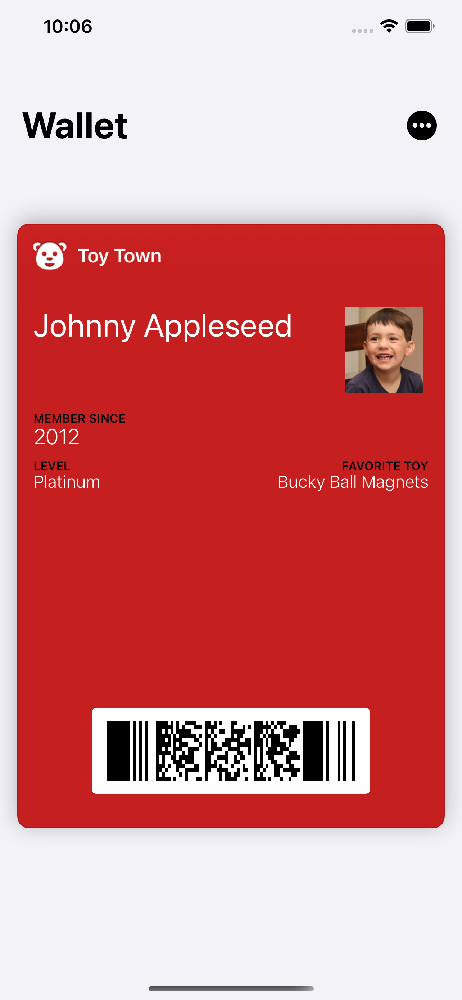
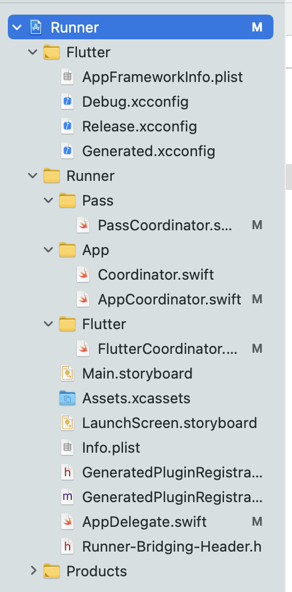

# A demo to integrate with Apple & Google wallet using Flutter

Currently there is no offical or third-party package in Flutter to directly integrate with Apple Wallet or Google Wallet. A workaround is to develop customer platform-specifc code using `MethodChannel`. This document gives a step-by-step guide for the integration

## 1. Create a pass

### 1.1. iOS

In iOS, passes are represented by files with extension `.pkpass`. To create a pass, please follow the [offical guide](https://developer.apple.com/library/archive/documentation/UserExperience/Conceptual/PassKit_PG/YourFirst.html#//apple_ref/doc/uid/TP40012195-CH2-SW1). 

I have created a pass with information below:

```json
{
  "formatVersion" : 1,
  "passTypeIdentifier" : "pass.com.jumpstart.passdemo",
  "serialNumber" : "8j23fm3",
  "webServiceURL" : "https://example.com/passes/",
  "authenticationToken" : "vxwxd7J8AlNNFPS8k0a0FfUFtq0ewzFdc",
  "teamIdentifier" : "2342JC9H48",
  "locations" : [
    {
      "longitude" : -122.3748889,
      "latitude" : 37.6189722
    },
    {
      "longitude" : -122.03118,
      "latitude" : 37.33182
    }
  ],
  "barcode" : {
    "message" : "123456789",
    "format" : "PKBarcodeFormatPDF417",
    "messageEncoding" : "iso-8859-1"
  },
  "organizationName" : "Toy Town",
  "description" : "Toy Town Membership",
  "logoText" : "Toy Town",
  "foregroundColor" : "rgb(255, 255, 255)",
  "backgroundColor" : "rgb(197, 31, 31)",
  "generic" : {
    "primaryFields" : [
      {
        "key" : "member",
        "value" : "Johnny Appleseed"
      }
    ],
    "secondaryFields" : [
      {
        "key" : "subtitle",
        "label" : "MEMBER SINCE",
        "value" : "2012"
      }
    ],
    "auxiliaryFields" : [
      {
        "key" : "level",
        "label" : "LEVEL",
        "value" : "Platinum"
      },
      {
        "key" : "favorite",
        "label" : "FAVORITE TOY",
        "value" : "Bucky Ball Magnets",
        "textAlignment" : "PKTextAlignmentRight"
      }
    ],
    "backFields" : [
      {
        "numberStyle" : "PKNumberStyleSpellOut",
        "label" : "spelled out",
        "key" : "numberStyle",
        "value" : 200
      },
      {
        "label" : "in Reals",
        "key" : "currency",
        "value" : 200,
        "currencyCode" : "BRL"
      },
      {
        "dateStyle" : "PKDateStyleFull",
        "label" : "full date",
        "key" : "dateFull",
        "value" : "1980-05-07T10:00-05:00"
      },
      {
        "label" : "full time",
        "key" : "timeFull",
        "value" : "1980-05-07T10:00-05:00",
        "timeStyle" : "PKDateStyleFull"
      },
      {
        "dateStyle" : "PKDateStyleShort",
        "label" : "short date and time",
        "key" : "dateTime",
        "value" : "1980-05-07T10:00-05:00",
        "timeStyle" : "PKDateStyleShort"
      },
      {
        "dateStyle" : "PKDateStyleShort",
        "label" : "relative date",
        "key" : "relStyle",
        "value" : "2013-04-24T10:00-05:00",
        "isRelative" : true
      }
    ]
  }
}

```

The file can be found in `./pass/Generic.pass`. After adding to the wallet, it shows as below:



In production, the pass file should be created on server based on user's information. In this demo, I upload the pass file to AWS S3 and download the file with platform specific code and add it to wallet. 

### 1.2. Android

## 2. Flutter code

The code in flutter side is straightforward:

```dart
// 1. create a MethodChannel
static const platform = const MethodChannel('com.jumpstart.hkard/pass');

// 2. create a function to call swift code
Future<void> _calliOSToAddPass() async {
  try {
    final int result = await platform.invokeMethod('createPassWithURL', {
      'passURL':
      'https://pass-demo-bucket.s3.us-east-2.amazonaws.com/Generic.pkpass'
    });
    print('Result: $result');
  } on PlatformException catch (e) {
    print("Failed: '${e.message}'.");
  }
}
```

The above code should be triggered by the `onPressed()` function of a button. It does two things:

1. Create a `MethodChannel`, which is the linkage between flutter and platform specific code
2. Create a function within the channel. The function invokes the `createPassWithURL` method implemented in iOS with URL of the pass as an argument.

## 3. Platform specific code

### 3.1. iOS

#### Project file structure



I have modified `AppDelegate.swift` and created four files:

1. Coordinator.swift
2. AppCoordinator.swift
3. PassCoordinator.swift
4. FlutterCoordinator.swfit

#### Coordinator & AppCoordinator

```swift
import Foundation
import UIKit

protocol Coordinator: class {
    var childCoordinators: [Coordinator] { get }
    func add(_ coordinator: Coordinator)
    func remove(_ coordinator: Coordinator)
    func removeAll()
    func start()
}

class BaseCoordinator:  Coordinator{
    private var _childCoordinators: [Coordinator] = []
    
    var childCoordinators: [Coordinator] {
        return self._childCoordinators
    }
    
    init() {
        guard type(of: self) != BaseCoordinator.self else {
            fatalError(
                "BaseCoordinator cannot be instantiated"
            )
        }
    }
    
    func add(_ coordinator: Coordinator) {
        self._childCoordinators.append(coordinator)
    }
    
    func remove(_ coordinator: Coordinator) {
        self._childCoordinators = self.childCoordinators.filter { $0 !== coordinator }
    }
    
    func removeAll() {
        self._childCoordinators.removeAll()
    }
    
    func start() {}
}
```

The **Coordinator.swift** defines a base class for other three coordinators to use. For example, the **AppCoordinator.swift** below:

```swift
import Foundation
import UIKit

class AppCoordinator: BaseCoordinator {
    weak var navigationController: UINavigationController?
    
    init(navigationController: UINavigationController) {
        super.init()
        self.navigationController = navigationController
    }
    
    override func start() {
        super.start()
    }
    
    func downloadAndSetPassWithURL(url: String) {
        navigateToPassViewControllerWithURL(url: url)
    }
}

protocol PassToAppCoordinatorDelegate: class {
    func navigateToFlutterViewController()
}

protocol FlutterToAppCoordinatorDelegate: class {
    func navigateToPassViewControllerWithURL(url: String)
}

extension AppCoordinator: PassToAppCoordinatorDelegate {
    func navigateToFlutterViewController(){
        let coordinator = FlutterCoordinator(navigationController: self.navigationController)
        coordinator.delegate = self
        self.add(coordinator)
        coordinator.start()
    }
}

extension AppCoordinator: FlutterToAppCoordinatorDelegate {
    func navigateToPassViewControllerWithURL(url: String){
        let coordinator = PassCoordinator(navigationController: self.navigationController)
        coordinator.delegate = self
        self.add(coordinator)
        coordinator.start()
        coordinator.retrievePass(url: url)
    }
}
```

So AppCoordinator gets the UINavigationController as root view controller. This Navigation controller will allow us to present a `PKAddPassesViewController`. We also created two protocols **PassToAppCoordinatorDelegate** and **FlutterToAppCoordinatorDelegate.** PassToAppCoordinatorDelegate and FlutterCoordinator will delegate the navigation to AppCoordinator (using the protocols, allows code decoupling). There are some new classes that I will create later.

Now that Coordinator.swift and AppCoordinator.swift is in place let’s go to the **AppDelegate** and write some code.

#### AppDelegate

```swift
import UIKit
import Flutter

@UIApplicationMain
@objc class AppDelegate: FlutterAppDelegate {
  private var mainCoordinator: AppCoordinator?
    
    override func application(
    _ application: UIApplication,
    didFinishLaunchingWithOptions launchOptions: [UIApplication.LaunchOptionsKey: Any]?
    ) -> Bool {
    
        GeneratedPluginRegistrant.register(with: self)

        // create and configure the channel
        let flutterViewController: FlutterViewController = window?.rootViewController as! FlutterViewController
        let passChannel = FlutterMethodChannel(name: "com.jumpstart.hkard/pass",
                                              binaryMessenger: flutterViewController.binaryMessenger)

        passChannel.setMethodCallHandler{
            (call, result) in
            self.handle(call, result)
        }

        GeneratedPluginRegistrant.register(with: self)
        let navigationController = UINavigationController(rootViewController: flutterViewController)
        navigationController.isNavigationBarHidden = true
        window?.rootViewController = navigationController
        mainCoordinator = AppCoordinator(navigationController: navigationController)
        window?.makeKeyAndVisible()

        return super.application(application, didFinishLaunchingWithOptions: launchOptions)
    }
    
    private func handle(_ call: FlutterMethodCall, _ result: FlutterResult) {
        switch call.method {
        case "createPassWithURL":
            let args: NSDictionary = call.arguments as! NSDictionary
            guard let passURL = args["passURL"] as? String else {
                return
            }
            
            print(passURL)
            self.mainCoordinator?.start()
            self.mainCoordinator?.downloadAndSetPassWithURL(url: passURL)
        default:
            result(FlutterMethodNotImplemented)
        }
    }
}
```

The rootViewController is set to be FlutterViewController. Create an UINavigationController and set it’s rootViewController the FlutterViewController. We change the window rootViewController to be the navigationController. isNavigationBarHidden makes the navigation bar hidden and **makeKeyAndVisible** puts our window on top.

And we also set up the MethodChannel and function here. When the MethodChannel is called in flutter, the `handle` function will be invoked.

#### PassCoordinator.swift

```swift
import Foundation
import UIKit
import PassKit

final class PassCoordinator: BaseCoordinator {
    weak var navigationController: UINavigationController?
    weak var delegate: PassToAppCoordinatorDelegate?
    
    init(navigationController: UINavigationController?) {
        super.init()
        self.navigationController = navigationController
    }
    
    override func start() {
        super.start()
    }
    
    func retrievePass(url: String) {
        let url = URL(string: url)!
        
        let task = URLSession.shared.dataTask(with: url) { (data, response, error) in
            guard let data = data as NSData? else {
                return
            }
            
            print("successfully retrieved pass data from server")
            
            DispatchQueue.main.async {
                self.openPassWithData(passData: data)
            }
        }
        
        task.resume()
    }
    
    func openPassWithData(passData : NSData) {
        do {
            let newpass = try PKPass.init(data: passData as Data)
            let addController =  PKAddPassesViewController(pass: newpass)
            addController?.delegate = navigationController as? PKAddPassesViewControllerDelegate
            navigationController?.present(addController!, animated: true)
        } catch {
            let alert = UIAlertController(title: "Error", message: "PassKit not available", preferredStyle: .alert)
            alert.addAction(UIAlertAction(title: "OK", style: .default, handler: { action in
                switch action.style{
                case .default:
                    print("default")
                case .cancel:
                    print("cancel")
                case .destructive:
                    print("destructive")
                @unknown default:
                    break
                }}))
            navigationController?.present(alert, animated: true, completion: nil)

            print(error)
        }
    }
}
```

This file retrieves pass file from server with URL and present a `PKAddPassesViewController` for user to add the pass to its wallet.

#### FlutterCoordinator.swift

In the flutter component folder we only have the coordinator to return to the previous view.

```swift
import Foundation
import UIKit

final class FlutterCoordinator: BaseCoordinator{
    weak var navigationController: UINavigationController?
    weak var delegate: FlutterToAppCoordinatorDelegate?
    
    override func start() {
        super.start()
        navigationController?.popToRootViewController(animated: true)
    }
    
    init(navigationController: UINavigationController?) {
        super.init()
        self.navigationController = navigationController
    }
}
```

Now run the project using Xcode or `Flutter run`. You will see the result below:


### 3.2. Android

## Reference links


[Design passkit for both iOS and Android](https://app.passkit.com/)

[Apple's add to apple wallet guidelines](https://developer.apple.com/library/archive/documentation/UserExperience/Conceptual/PassKit_PG/YourFirst.html#//apple_ref/doc/uid/TP40012195-CH2-SW1)

[pass_flutter, a flutter library to work with Apple Wallet passes](https://pub.dev/packages/pass_flutter)


